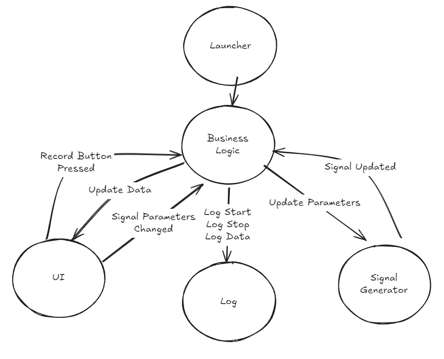

# LabVIEW Türkiye Community - DQMH Live Coding: Signal Generator Project

## Overview
This repository contains the **Signal Generator application** developed during the LabVIEW Türkiye community live coding event. The project is designed to demonstrate a **modular architecture** where modules operate without direct dependencies on one another. 

## Features
The application provides the following core functionalities:
*   **Signal Configuration:** Users can modify key parameters including **frequency, amplitude, and signal type**.
*   **Data Logging:** The application includes the capability to **save the generated signal** data

## Architecture
The project follows a decoupled design pattern consisting of specific modules to ensure modularity. The system is divided into the following components:

### Modules
*   **Business Logic**: Handles the coordination and logic of the application.
*   **Signal Generator**: Responsible for producing the waveform signals.
*   **UI**: Manages the user interface and user interactions. 
*   **Logger**: dedicated to the saving and logging of signal data.

